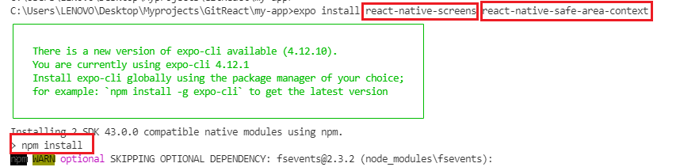
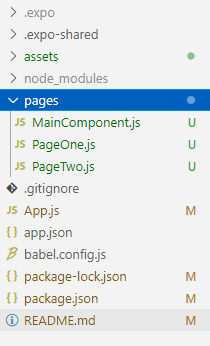

# React Native Elements and Navigation

## Install Dependencies

### [React Native Elements](https://reactnativeelements.com/)

`npm install react-native-elements`

`npm install react-native-vector-icons`

`npm install react-native-safe-area-context`

### [React Navigation](https://reactnavigation.org/)

`npm install @react-navigation/native`

`expo install react-native-screens react-native-safe-area-context`

`npm install @react-navigation/native-stack`

---

### Package.json Before

```JSON
  "dependencies": {
    "expo": "~43.0.0",
    "expo-status-bar": "~1.1.0",
    "react": "17.0.1",
    "react-dom": "17.0.1",
    "react-native": "0.64.2",
    "react-native-web": "0.17.1"
  },
```

### Package.json After

```JSON
  "dependencies": {
    "@react-navigation/native": "^6.0.6",           // 1
    "@react-navigation/native-stack": "^6.2.5",     // 2
    "expo": "~43.0.0",
    "expo-status-bar": "~1.1.0",
    "react": "17.0.1",
    "react-dom": "17.0.1",
    "react-native": "0.64.2",
    "react-native-elements": "^3.4.2",              // 3
    "react-native-safe-area-context": "3.3.2",      // 4
    "react-native-screens": "~3.8.0",               // 5
    "react-native-vector-icons": "^9.0.0",          // 6
    "react-native-web": "0.17.1"
  },
```

---

## **expo install [package-name]**



## **App.js - Before**

```JavaScript
import { StatusBar } from 'expo-status-bar';
import React from 'react';
import { StyleSheet, Text, View } from 'react-native';

export default function App() {
  return (
    <View style={styles.container}>
      <Text>Open up App.js to start working on your app!</Text>
      <StatusBar style="auto" />
    </View>
  );
}

const styles = StyleSheet.create({
  container: {
    flex: 1,
    backgroundColor: '#fff',
    alignItems: 'center',
    justifyContent: 'center',
  },
});
```

## **Create Folder and Some files**

```
my-app
| ...
+--- App.js
+--- package.json
| ...
+----pages
    +--- MainComponent.js
    +--- PageOne.js
    +--- PageTwo.js
```



## **PageOne.js**

```JavaScript
import React from 'react'
import { View, Text } from 'react-native'

const PageOne = () => {
    return (
        <View style={{ flex: 1, alignItems: 'center', justifyContent: 'center' }}>
            <Text>Page One</Text>
        </View>
    )
}

export default PageOne

```

## **PageTwo.js**

```JavaScript
import React from 'react'
import { View, Text } from 'react-native'

const PageOne = () => {
    return (
        <View style={{ flex: 1, alignItems: 'center', justifyContent: 'center' }}>
            <Text>Page One</Text>
        </View>
    )
}

export default PageOne

```

## **MainComponent.js**

```JavaScript
import React from 'react'
import { NavigationContainer } from '@react-navigation/native';
import { createNativeStackNavigator } from '@react-navigation/native-stack';
import PageOne from './PageOne';
import PageTwo from './PageTwo';


const Stack = createNativeStackNavigator();

const MainComponent = () => {
    return (
        <NavigationContainer>
            <Stack.Navigator>
                <Stack.Screen name='Page One' component={PageOne} />
                <Stack.Screen name='Page Two' component={PageTwo} />
            </Stack.Navigator>
        </NavigationContainer>
    )
}

export default MainComponent

```

## **App.js - Updated**

```JavaScript
import React from 'react';
import { SafeAreaProvider } from 'react-native-safe-area-context';
import MainComponent from './pages/MainComponent';

export default function App() {
  return (
    <SafeAreaProvider>
      <MainComponent />
    </SafeAreaProvider>
  );
}
```

---

## **Options - MainComponents.js**

```JavaScript
const MainComponent = () => {
    return (
        <NavigationContainer>
            <Stack.Navigator>
                <Stack.Screen
                    name='Page One'
                    component={PageOne}
                    options={{ title: 'Home Page' }} />
                <Stack.Screen
                    name='Page Two'
                    component={PageTwo}
                    options={{ headerShown: false }} />
            </Stack.Navigator>
        </NavigationContainer>
    )
}
```
## **Moving Between Screens**
